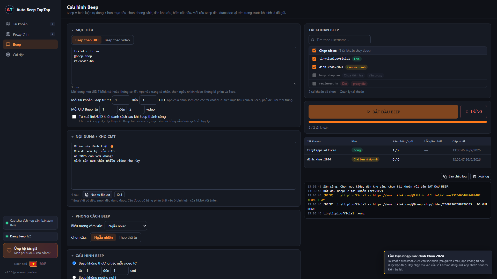
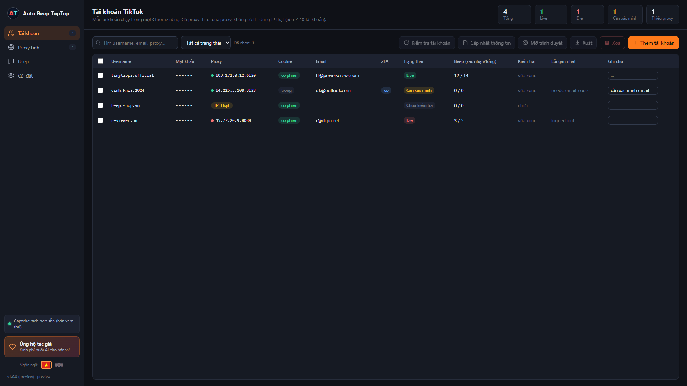
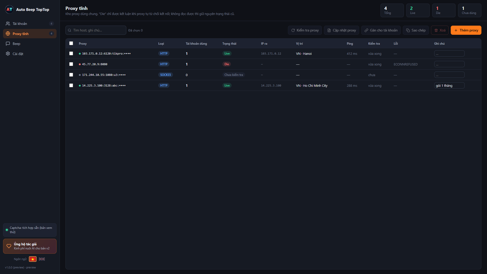
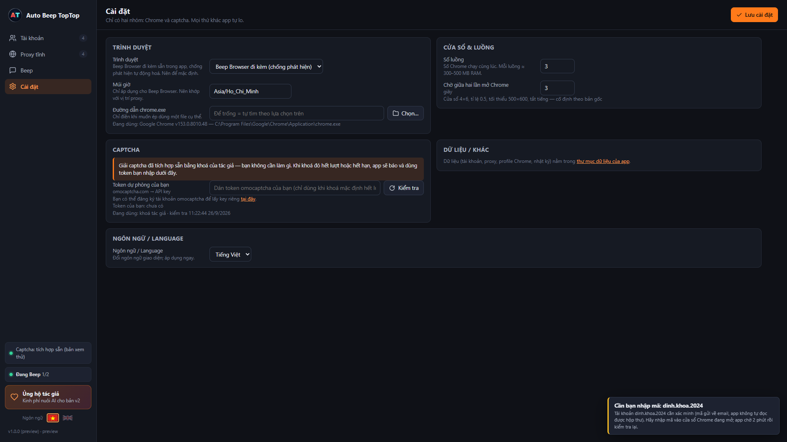

🇬🇧 English · [🇻🇳 Tiếng Việt](README.md)

  

<h1 align="center">Auto Beep TopTop</h1>

  <b>Automated TikTok comments, running entirely on your machine.</b> 
  Account management · Static proxies · Beep by UID / by video · Anti-detection browser · Built-in captcha solving

  <a href="https://github.com/tuleader/auto-beep-toptop/releases/download/v1.0.0/AutoBeepTopTop-Setup-1.0.0.exe"><b>⬇ Download AutoBeepTopTop-Setup-1.0.0.exe (Windows, 213 MB)</b></a> ·
  <a href="https://github.com/tuleader/auto-beep-toptop/releases/latest">All releases</a> ·
  <a href="https://auto-beep-toptop-site.vercel.app">Try the UI (demo)</a> ·
  <a href="https://github.com/tuleader/auto-beep-toptop/wiki">Guide (Wiki)</a> ·
  <a href="https://github.com/tuleader/auto-beep-toptop/wiki/%C4%90i%E1%BB%81u-kho%E1%BA%A3n-s%E1%BB%AD-d%E1%BB%A5ng">Terms of use</a> ·
  <a href="https://www.facebook.com/100017717225379">Support &amp; guidance (Facebook)</a> ·
  <a href="#-buy-the-author-a-coffee">☕ Buy a coffee</a>

---

## What the app does

| | |
|---|---|
| **TikTok accounts** | Bulk-paste `username\|password\|2fa\|email\|pass_email\|cookie\|proxy`, update info (password, email, email password, 2FA — exactly one account at a time; the button locks when more than one is selected), check live/dead, auto re-login when the cookie expires (2FA included), receives proxies assigned from the Static proxies page, open a browser for manual use. |
| **Static proxies** | An HTTP/HTTPS/SOCKS proxy pool, live/dead check with exit IP and location, counts how many accounts use each one; select proxies → **Assign to accounts** → pick the accounts, the assignment mode (one proxy–one account, round robin, one proxy–many accounts, random) and the quantity. |
| **Beep** | Pick targets by **UID** (the app opens the profile itself and picks a non-pinned video) or by **video link** — each source keeps its own target list; "Each account Beeps from" X to Y links/UIDs, spread across accounts with the least-assigned target first; paste a comment bank by hand or load a `.txt` file, with optional auto-removal of sent comments from the bank and of a link/UID from its list once Beeping on it succeeds; optionally watch the video / like it before Beeping — after commenting, the browser always lingers on the video for X to Y more seconds (mandatory, minimum 3 s); **Beep mercilessly** (X to Y comments per video) or **Beep relentlessly** (loops until the comment bank runs out); Beep every X to Y seconds; random happy/angry emoji; tag the video owner. |
| **Beep Browser** | A bundled anti-detection browser — nothing extra to install. Can switch to your machine's Google Chrome in Settings. |
| **Captcha** | Built in, no setup needed. The default key is paid for and maintained by the author; when it runs out, the app tells you so you can use your own token. |
| **Data** | Accounts, cookies, proxies, and logs live in `%APPDATA%\AutoBeepTopTop` on your machine. No server, nothing collected. |

## Screenshots

| Beep | Accounts |
|---|---|
|  |  |

| Static proxies | Settings |
|---|---|
|  |  |

## Install

> Detailed guide (system requirements, where the data lives, upgrading, uninstalling): [Wiki → English guide](https://github.com/tuleader/auto-beep-toptop/wiki/English-guide).

1. Download the installer: **[AutoBeepTopTop-Setup-1.0.0.exe](https://github.com/tuleader/auto-beep-toptop/releases/download/v1.0.0/AutoBeepTopTop-Setup-1.0.0.exe)** (213 MB). Other builds are on the [Releases](https://github.com/tuleader/auto-beep-toptop/releases/latest) page.
2. Run the installer (no admin rights needed). Windows SmartScreen may warn because the installer isn't code-signed: choose *More info → Run anyway*.
3. Open the app, read and accept the terms, add accounts and proxies, go to the **Beep** tab.

Requirements: Windows 10/11 64-bit, ~1 GB of space (Beep Browser included), an Internet connection. Each browser window running in parallel needs about 300–500 MB RAM.

## Quick start

> Screen-by-screen walkthrough, reading results, handling verification codes: [Wiki → English guide](https://github.com/tuleader/auto-beep-toptop/wiki/English-guide).

1. **Static proxies** → *Add proxies* (one per line) → *Check proxies*.
2. **Accounts** → *Add accounts* (one per line, a proxy can be included) → *Check accounts*.
3. **Beep** → choose *Beep by UID* or *Beep by video* → paste targets → paste the comment bank → choose accounts → **START BEEPING**.
4. Watch the results table and the log: the *Beep confirmed / sent* column is the real count.

In Beep → Advanced, the "Only run accounts that have a proxy" toggle is on by **default**: accounts without a proxy are skipped, with a notice. Turn it off and those accounts still run — on the machine's real IP.

## Support

Need help, found a bug, or want to suggest something: message the author on **Facebook** → https://www.facebook.com/100017717225379

## ☕ Buy the author a coffee

The app is free. A cup of coffee from you is the budget that lets the author feed the AI and ship v2. Support is voluntary and does not trade for any feature or perk in the current version.

<table>
  <tr>
    <td width="260" align="center"></td>
    <td valign="top">
      <b>Bank:</b> TPBank 
      <b>Account holder:</b> TA NGOC TU 
      <b>Account number:</b> <code>0066 6777 888</code> 
      <b>Note:</b> <code>Moi cafe Auto Beep Toptop</code> (already filled in the QR code)  
      Scan the VietQR code with any banking app, or click <i>Support the author</i> right inside the app. 
      Support is voluntary, with no perk or commitment attached — thank you ❤
    </td>
  </tr>
</table>

## v2 roadmap

- AI-powered Beep: comments generated from each video's own context, not just picked from a fixed bank.
- Multilingual: Beep in multiple languages without writing a separate comment bank for each one.
- More styles: pick a tone (playful, angry, serious…) for the AI to match.
- Comment suggestions based on lines that have "confirmed" successfully before.
- Still runs entirely on your machine — no change to the current data model.

## Terms

Full terms of use: [Wiki → Terms of use](https://github.com/tuleader/auto-beep-toptop/wiki/%C4%90i%E1%BB%81u-kho%E1%BA%A3n-s%E1%BB%AD-d%E1%BB%A5ng) (a copy is kept in the repo: [TERMS.md](TERMS.md)). **The Vietnamese version is the one with legal effect.** The version inside the app and this one are the same document; when the terms change, the app asks you to accept again.

---

Auto Beep TopTop is not affiliated with TikTok or Google. Beep Browser is built on Chromium (BSD) and fingerprint-chromium (BSD-3-Clause).
