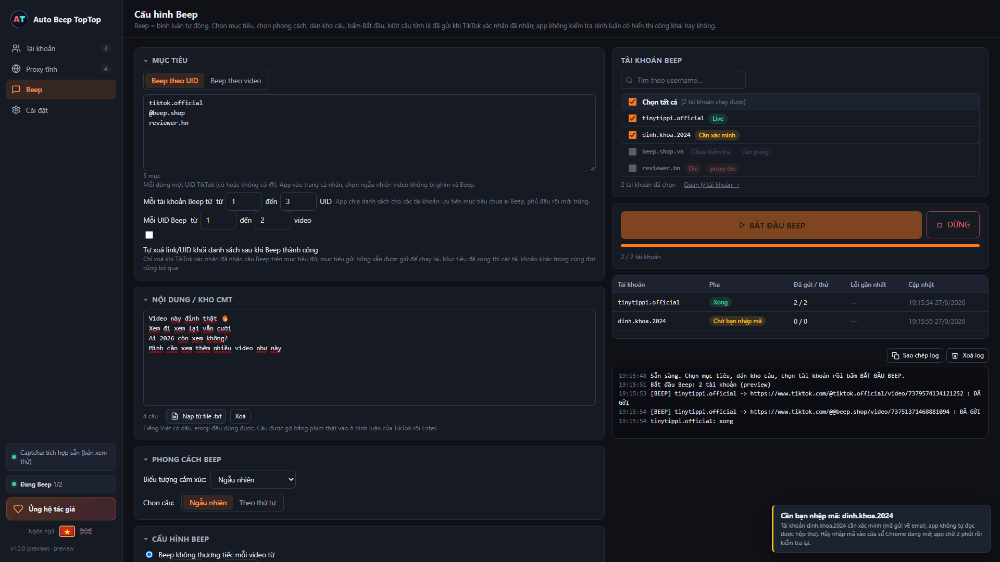
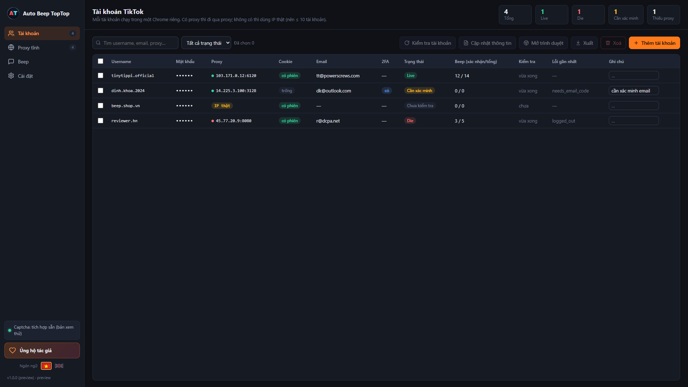
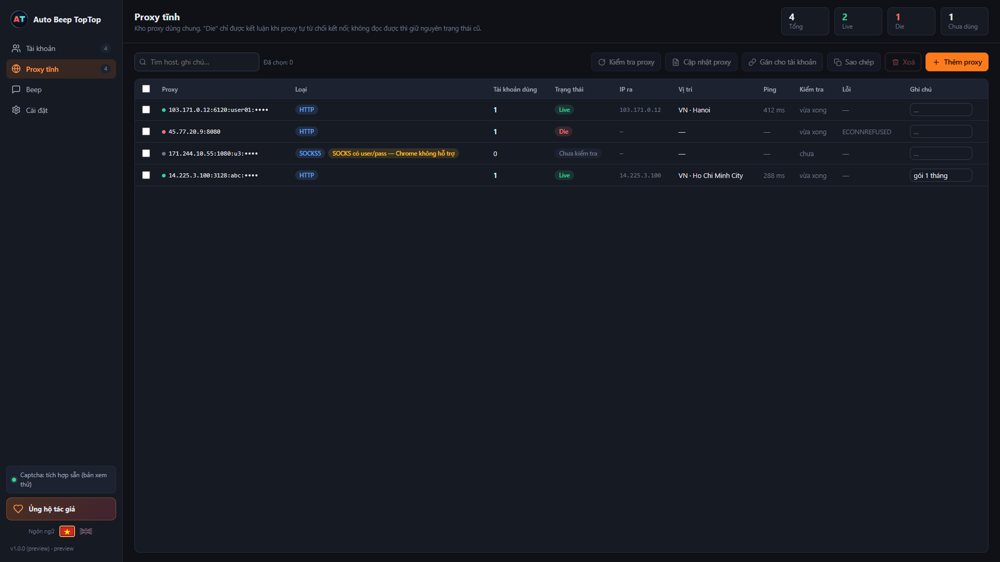
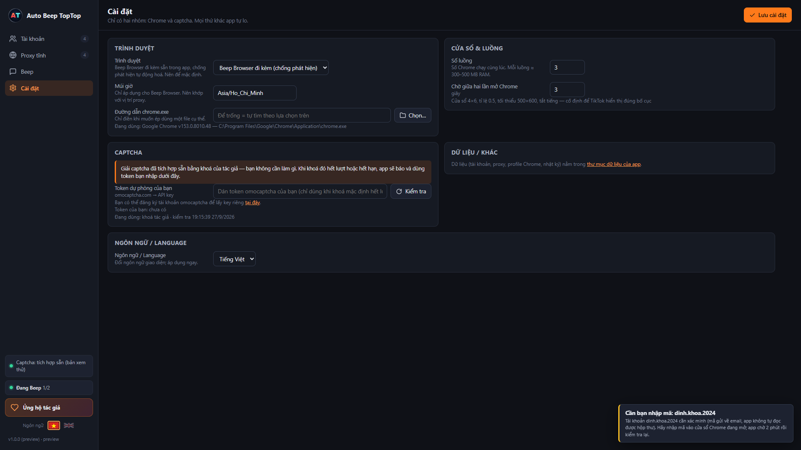

🇬🇧 English · [🇻🇳 Tiếng Việt](README.md)

  

# 📢 Auto Beep TopTop — TikTok Auto Beep 2026

**Auto Beep TopTop** is a tool that "Beeps" — posts comments automatically — on TikTok from many accounts at once: fast, evenly paced, and without you babysitting every video.

Paste your accounts, paste a comment bank, pick targets by **UID** or by **video link**, click **"Start Beeping"** — the app does the rest: it opens every account in its own browser (through its own proxy, if you assign one), opens the video, watches, likes, types the line, and sends it. A comment counts as **sent** when TikTok confirms it received it; the app does not check whether the comment is publicly visible (TikTok may hide some accounts' comments from other people). Everything runs on your machine; there is no server in between.

  <a href="https://github.com/tuleader/auto-beep-toptop/releases/download/v1.0.0/AutoBeepTopTop-Setup-1.0.0.exe"><b>⬇ Download AutoBeepTopTop-Setup-1.0.0.exe (Windows, 213 MB)</b></a> ·
  <a href="https://auto-beep-toptop-site.vercel.app">Try the UI (demo)</a> ·
  <a href="https://github.com/tuleader/auto-beep-toptop/wiki">Guide (Wiki)</a> ·
  <a href="https://www.facebook.com/100017717225379">Support (Facebook)</a> ·
  <a href="#-buy-the-author-a-coffee">☕ Buy a coffee</a>

---

## ✨ Highlights

* **One-click Beep:** paste targets, paste the comment bank, tick accounts, click **"Start Beeping"**. No browser setup, nothing else to install.
* **Beep by UID or by video:** by UID the app opens the profile itself and picks a random non-pinned video; by link it Beeps exactly the video you gave. Each mode keeps its own target list.
* **Two run modes:** **Beep mercilessly** — X to Y comments per video, then the next one; **Beep relentlessly** — loop over the targets until the comment bank runs dry.
* **Smart work sharing:** set "each account Beeps from X to Y links/UIDs"; the app spreads the list across accounts and always prefers the targets with the fewest Beeps so far, so the list is covered evenly before anyone overlaps.
* **Beeps like a person:** optionally watch the video and like it before commenting; after sending, the browser **always stays on that video** for a few seconds before moving on; random gaps between Beeps; random happy/angry emoji; tag the video owner.
* **A bank that tidies itself:** sent lines leave the bank, finished links/UIDs leave their list (two options, off by default), even while you are on another page of the app.
* **One browser per account:** the bundled **Beep Browser** gives a separate profile per account — cookies and cache are never shared between accounts. Deleting an account also deletes its profile (login session). Switch to your machine's Google Chrome in Settings if you prefer.
* **A static proxy per account (optional, not required):** an HTTP/HTTPS/SOCKS proxy pool with live/dead checks, exit IP and location; select proxies → **Assign to accounts** with 4 assignment modes (1–1, round robin, 1–many, random). An account with a proxy sends every tab of its browser through it; without one it runs on the machine's real IP.
* **Bulk account management:** paste `username|password|2fa|email|pass_email|cookie|proxy`, check live/dead, automatic password re-login when the cookie expires (2FA included), open a browser for manual work when needed.
* **Built-in captcha solving:** when a captcha appears the app solves it and shows a status strip right on the captcha so you can see what it is doing. The default key is maintained by the author; when it runs out the app tells you so you can use your own.
* **Your data stays with you:** accounts, cookies, proxies and logs live in `%APPDATA%\AutoBeepTopTop`. No server, nothing collected.
* **Vietnamese / English UI**, switched instantly with the flag buttons in the sidebar.

## 🖼 Screenshots

| Beep | Accounts |
|---|---|
|  |  |

| Static proxies | Settings |
|---|---|
|  |  |

## 🚀 How to use

1. Download **[AutoBeepTopTop-Setup-1.0.0.exe](https://github.com/tuleader/auto-beep-toptop/releases/download/v1.0.0/AutoBeepTopTop-Setup-1.0.0.exe)** and run it (no admin rights needed). Windows SmartScreen may ask because the installer isn't code-signed: choose *More info → Run anyway*.
2. Open the app, accept the terms, then add your data: **Accounts** → *Add accounts* → *Check accounts*. To use proxies (optional): **Static proxies** → *Add proxies* → *Check proxies* → *Assign to accounts*.
3. Go to the **Beep** tab, choose *Beep by UID* or *Beep by video*, paste targets, paste the comment bank, tick accounts, click **"Start Beeping"** and let Auto Beep TopTop take care of the rest!

> Screen-by-screen walkthrough, reading results, handling verification codes: [Wiki → English guide](https://github.com/tuleader/auto-beep-toptop/wiki/English-guide).
>
> Requirements: Windows 10/11 64-bit, ~1 GB of space (Beep Browser included), Internet. Each browser window running in parallel needs about 300–500 MB RAM. Proxies are optional: in Beep → Advanced, "Only run accounts that have a proxy" is on by **default** (proxy-less accounts are skipped with a notice); turn it off and those accounts still run, on the machine's real IP.

## 📥 Download & Support

* **Releases:** [Releases](https://github.com/tuleader/auto-beep-toptop/releases/latest)
* **Try the UI without installing:** [auto-beep-toptop-site.vercel.app](https://auto-beep-toptop-site.vercel.app)
* **Guide, FAQ, terms:** [Wiki](https://github.com/tuleader/auto-beep-toptop/wiki)
* **Bugs / ideas / help:** message the author on [Facebook](https://www.facebook.com/100017717225379) or open an [Issue](https://github.com/tuleader/auto-beep-toptop/issues)

## ☕ Buy the author a coffee

The app is free, and the build you are using is a beta. A cup of coffee from you is a small push toward the official release. Support is voluntary and does not trade for any feature or perk in the current version.

<table>
  <tr>
    <td width="260" align="center"></td>
    <td valign="top">
      <b>Bank:</b> TPBank 
      <b>Account holder:</b> TA NGOC TU 
      <b>Account number:</b> <code>0066 6777 888</code> 
      <b>Note:</b> <code>Moi cafe Auto Beep Toptop</code> (already filled in the QR code)  
      Scan the VietQR code with any banking app, or click <i>Support the author</i> right inside the app. 
      Support is voluntary, with no perk or commitment attached — thank you ❤
    </td>
  </tr>
</table>

## 🛣 Roadmap to the official release

* **AI-powered Beep:** comments generated from each video's own context, not just picked from a fixed bank.
* **Multilingual:** Beep in multiple languages without writing a separate comment bank for each one.
* **More styles:** pick a tone (playful, angry, serious…) for the AI to match.
* **Comment suggestions** based on lines that have been sent successfully before.
* Still runs entirely on your machine — no change to the current data model.

## 📜 Terms

Full terms of use: [Wiki → Terms of use](https://github.com/tuleader/auto-beep-toptop/wiki/%C4%90i%E1%BB%81u-kho%E1%BA%A3n-s%E1%BB%AD-d%E1%BB%A5ng) (a copy is kept in the repo: [TERMS.md](TERMS.md)). **The Vietnamese version is the one with legal effect.** The version inside the app and this one are the same document; when the terms change, the app asks you to accept again.

## 🤝 Credits

* Beep Browser is a public build of **Chromium** (BSD), **ungoogled-chromium** and **fingerprint-chromium** (BSD-3-Clause); the author only packages it, and the licenses are in the install's `browser` folder.
* Captcha solving through **omocaptcha**.
* Developed by **[tuleader](https://github.com/tuleader)**.

---

*If you find the tool useful, leave a ⭐ on the repo!*

Auto Beep TopTop is not affiliated with TikTok or Google.
